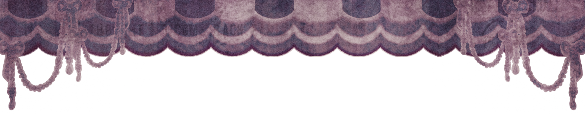
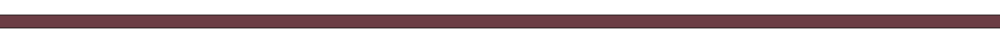

   

# HI. so im gonna talk about how i act, type or idk, and about the status.

***How can you understand my feelings through(?) how i text!:***

* so basically, if i put a "." after anything, that can mean i am serious, mad or sad. So um.. iwc ig? 
* i always try to find something to text back. and if i cant find, ill just put emojs or just stay silent!!😔
* if i stay alone, that can be because im shy to go to my friends or even talk to them😭i just simply dont wanna bother ppl with myself 
* if i make no typo, then i am serious and mad or sad💓 

***Status!***
* *away:* mostly afk or feeling comfy
* *busy:* mostly afk again but dont want to int w someone!!
* *looking for chat:* looking for someone to talk to.🫡 intme

* **if i cuddle you, you can always go away without feeling something. I will just be confused!**
* **if i text your atabook/strawpage so much, maybe i think about you sm😭 dont hesitate to ignore my texts!**
* **if i dont answer your whisper or any message on ponytown, then there is 4 possibility! 1, i am afk/offtab. 2, i am shy to respond. 3, i am not interested in what you say, so pretending to be afk! or 4, i dont feel like talking. the third one is mostly to the people i dont know. dont think about it..**
* **if i change my name so much, i am listening songs or talking with someone! it can be everything. i love to change my name like how i feel.**

idk more but yh. ill update this if needed. BTW C+H FREELY!! if i have dni on my name just dont talk and c+h<3 **BYEEEEEE**

